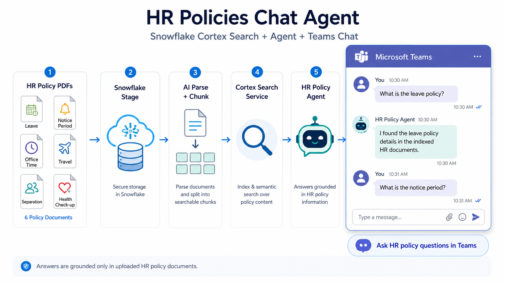
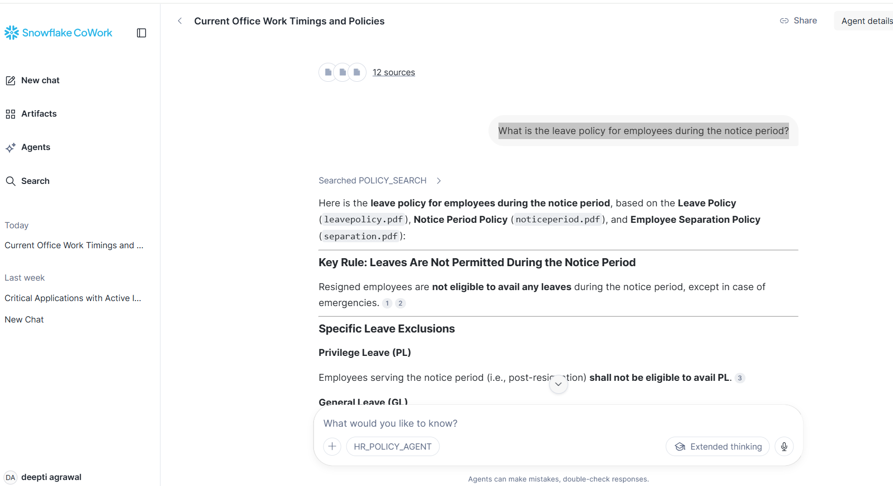
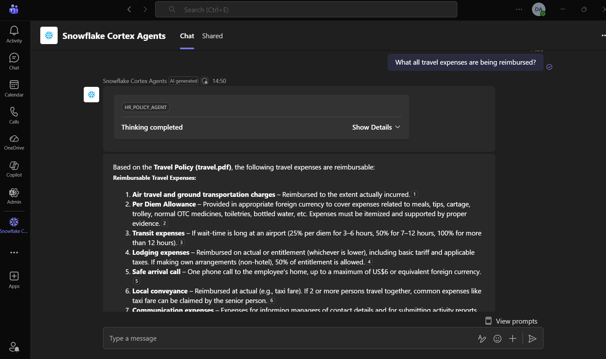

## Teams Cortex Chat Agent-HR policies

A Snowflake Cortex Search project that helps employees find answers from HR policy documents through natural-language conversations within their Teams chat.

The project uploads HR policy PDFs to a Snowflake stage, extracts and chunks the document content, creates a Cortex Search Service, and connects it to a Cortex Agent. The agent can be accessed through Snowflake Cortex CoWork and Microsoft Teams Chat.



### Use Case

Employees/New Joiners often need quick answers to questions such as:
1. What is the leave policy?
2. What are the office working hours?
3. What is the notice period?
4. Who is eligible for an annual health check-up?
5. What is the business travel process?
6. What is the employee separation process?

The agent answers only from the uploaded HR policy documents.
### Documents Included

The Cortex Search Service is created using the following HR policies: 
The dataset has been downloaded from Kaggle 
https://www.kaggle.com/datasets/harekalrajesh/hr-policy-docs-pdf?resource=download

- Annual Health Check-up Policy
- Leave Policy
- Notice Period Policy
- Office Time Policy
- Separation Policy
- Travel Policy

Questions related to payroll, flexible pay, investment declaration, onboarding, IT access, or other HR topics are outside the scope of this demo.
### Architecture
```text
HR Policy PDFs
      │
      ▼
Snowflake Stage
      │
      ▼
AI Parse Document
      │
      ▼
Document Chunking
      │
      ▼
Cortex Search Service
      │
      ▼
Cortex Agent
      │
      ├── Snowflake Cortex CoWork
      │
      └── Microsoft Teams Application
```
## Setup

### 1. Create Snowflake Objects

Create the database, schema, warehouse, stage, and required tables.

```sql
01_setup_load_data_parse_pdf/01_create_db_schema_warehouse.sql
```

### 2. Upload HR Policy PDFs

Upload the policy documents to the Snowflake stage.

```sql
01_setup_load_data_parse_pdf/02_load_data.sql
```

### 3. Parse and Chunk Documents

Extract text from the PDFs and split it into searchable chunks.

```sql
01_setup_load_data_parse_pdf/03_parsing_and_chunking.sql
```

### 4. Create Cortex Search Service

Create the Cortex Search Service on top of the chunked policy table.

```sql
02_create_search_service_and_agent/01_create_search_service.sql
```

### 5. Create HR Policy Agent

Create a Cortex Agent that uses only the Cortex Search Service.

```sql
02_create_search_service_and_agent/02_create_agent.sql
```

### 6. Use the Agent in Snowflake Cortex CoWork

Open Cortex CoWork in Snowflake, select the HR Policy Agent, and ask questions such as:

```text
What is the leave policy?

What are the office working hours?

What is the notice period?

Who is eligible for an annual health check-up?

What is the process for official business travel?
```



### 7. Connect Agent to Microsoft Teams

Configure Microsoft authentication and connect the Snowflake Cortex Agent to Microsoft Teams.

```sql
03_connect_to_TeamsApp/01_Authenticate_Microsoft_Snowflake_app.sql
```

```sql
03_connect_to_TeamsApp/02_access_teams_app_agent.sql
```



## Agent Behaviour

The agent is designed to:

- Search the uploaded HR policy documents for every question.
- Answer only from retrieved policy content.
- Avoid generating or assuming policy details.
- Clearly say when a question is outside the available documents.
- Mention the relevant policy document where possible.

Example unsupported question:

```text
When does the investment declaration window open?
```

Expected response:

```text
This information is not covered in the currently available HR policy documents.
Please contact the HR or payroll team for clarification.
```

## Snowflake Features Used

- Snowflake Stage
- AI Parse Document
- Document chunking
- Cortex Search Service
- Cortex Agent
- Cortex CoWork
- Microsoft Teams integration

## Cleanup

Run the cleanup script to remove objects created for this project.

```sql
cleanup/cleanup_objects.sql
```

## Disclaimer

This project is created for demonstration purposes. The agent answers only from the uploaded HR policy documents and should not replace official guidance from HR, payroll, legal, tax, or compliance teams.